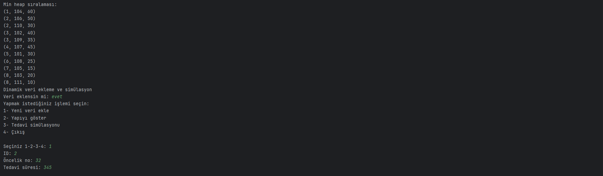
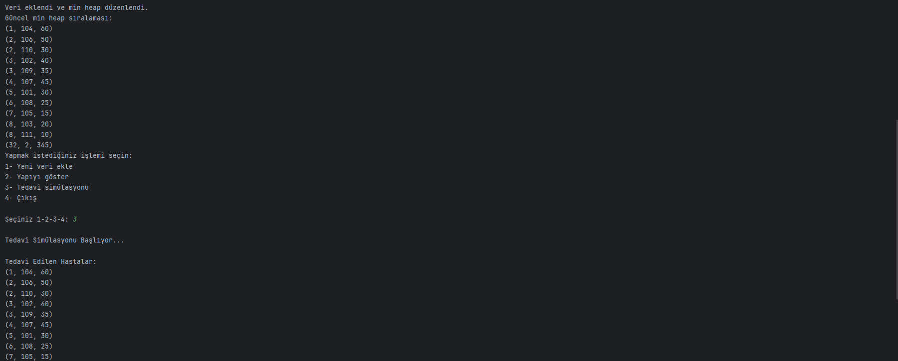
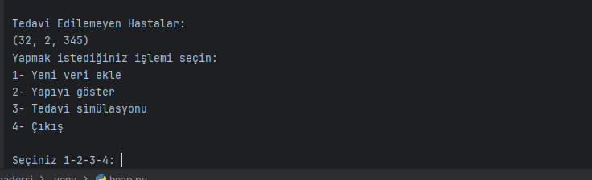

# MinHeap-HastaTedavi
# Tedavi Simülasyonu ve Veri Yönetimi

Bu Python programı, bir hastane yönetim sistemine benzeyen bir yapı kullanarak hastaların öncelik sırasına göre tedavi edilmesini sağlar. Program, öncelik seviyesine ve tedavi süresine dayalı bir `min heap` yapısını kullanır.

## Özellikler

1. **Dinamik Veri Ekleme:**
   - Kullanıcıdan hastaların ID'si, öncelik seviyesi ve tedavi süresi bilgileri alınarak yapıya eklenir.
   - Veriler, öncelik seviyesine göre sıralı bir şekilde saklanır.

2. **Yapıyı Görüntüleme:**
   - Mevcut `min heap` yapısını öncelik sırasına göre görüntüler.

3. **Tedavi Simülasyonu:**
   - Günlük toplam 7 saatlik (420 dakika) tedavi süresi boyunca öncelik sırasına göre hastaları tedavi eder.
   - Tedavi edilen ve edilemeyen hastaları ayrı listelerde görüntüler.
   - Tedavi edilemeyen hastaları bir sonraki gün için yapıya yeniden ekler.

4. **Çıkış:**
   - Programdan çıkış yapar.
Ekran Görüntüsü






## Gerekli Kütüphaneler

Program, standart Python kütüphanelerinden `heapq` kullanır. Ek bir bağımlılık gerekmez.

## Kurulum

1. Python 3.x'in bilgisayarınızda yüklü olduğundan emin olun.
2. Bu dosyayı bir `.py` uzantısı ile kaydedin, örneğin: `tedavi_simulasyonu.py`.

## Çalıştırma

1. Terminal veya komut satırını açın.
2. Dosyanın bulunduğu dizine gidin.
3. Aşağıdaki komut ile programı çalıştırın:
   ```bash
   python tedavi_simulasyonu.py
